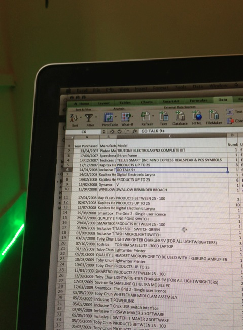

  

The Domesday Dataset
--------------------

Augmentative and alternative communication (AAC) devices provide the ability for many people with disabilities to make themselves understood. For the large proportion of AAC-users with an intellectual disability, it may well be the only such way. Estimates of user provision and numbers of AAC devices in use are both vague and lack detail, often as a result of the circumstances they were estimated in. This lack of data prevents researchers from answering fundamental questions like \`\`How many people per 1,000 are using electronic AAC?'', \`\`What proportion of AAC users have aids that have internet connectivity?'' and \`\`On average, how much money would fund a person's AAC use for 12 months?''. This causes a fundamental difficulty with the field at the research, governance and political levels.

We seek a full listing that includes every AAC aid purchased in the UK so that we can built a dataset that allows us to answer fundamental research, policy, and prevalence questions on the landscape of AAC use within the UK. Our work constructed a dataset by making several hundred Freedom of Information (FOI) requests, which asked the set of public bodies to supply lists of every AAC device purchased since 2006 including make, model, and year of purchase.

Here are the component parts of our dataset. The Domesday Dataset is made available under the Open Data Commons Attribution License: http://opendatacommons.org/licenses/by/1.0/

This is obviously a work in progress, do please contact (joe@equalitytime.co.uk) if you are going to draw any conclusions from the data, there are a number of caveats that we should probably go over. At the very least, you should read [this](DomesdayPrePeerReview.pdf) paper.

### Scotland

Version 1 is the consolidated raw data supplied by the scotish nhs trusts (appart from grampion, who are running late).

  
[Domesday-Scotland.csv](Domesday-Scotland.csv), released 29th May 2012  
  
[Domesday-Scotland.xlsx](Domesday-Scotland.xlsx), released 29th May 2012  
  
  

Version 2 is the same data, but I've added a lot of manufacturing and pricing information, made quite a few corrections and such.

  
[Domesday-Scotland.csv](Domesday-Scotland2.csv), released 6th June 2012  
  
[Domesday-Scotland.xlsx](Domesday-Scotland2.xlsx), released 6th June 2012  
  
  

Version 3 followed some help by various members of the AAC community.

  
[Domesday-Scotland.csv](Domesday-Scotland3.csv), released 24th October 2012  
  
[Domesday-Scotland.xlsx](Domesday-Scotland3.xlsx), released 24th October 2012  
  
  

### England

This is the NHS data released as a work-in-progress at the communication matters conference 2012. It's released here so that people can review the data supplied by their PCTs, we would NOT recommend drawing conclusions from it JUST  yet, particularly without reference to the accompanying literature.  
  
[Domesday-England-CM.xlsx](Domesday-England-CM.xlsx), released 27th September 2012  
  
[Domesday-England-CM.csv](Domesday-England-CM.csv), released 27th September 2012  

Following in the conference we are pleased to be able to say that a bunch of manufacturers and other interested members of the community helped out with validation and error checking. This gave us the following versions.

  
[Domesday-England-WithCMChanges.xlsx](Domesday-England-WithCMChanges.xlsx), released 19th October 2012  
  
[Domesday-England-WithCMChanges.csv](Domesday-England-WithCMChanges.csv), released 19th October 2012  

The following versions were released to support the Journal of Intellectual Disabilities paper

  
[Domesday-England-Journal.xlsx](Domesday-England-Journal.xlsx), released 20th February 2013  
  
[Domesday-England-Journal.csv](Domesday-England-Journal.csv), released 20th February 2013  

...and for the camera ready version...

  
[Domesday-England-CameraReady.xlsx](Domesday-England-CameraReady.xlsx), released 13th March 2013  
  
[Domesday-England-CameraReady.csv](Domesday-England-CameraReady.csv), released 13th March 2013
